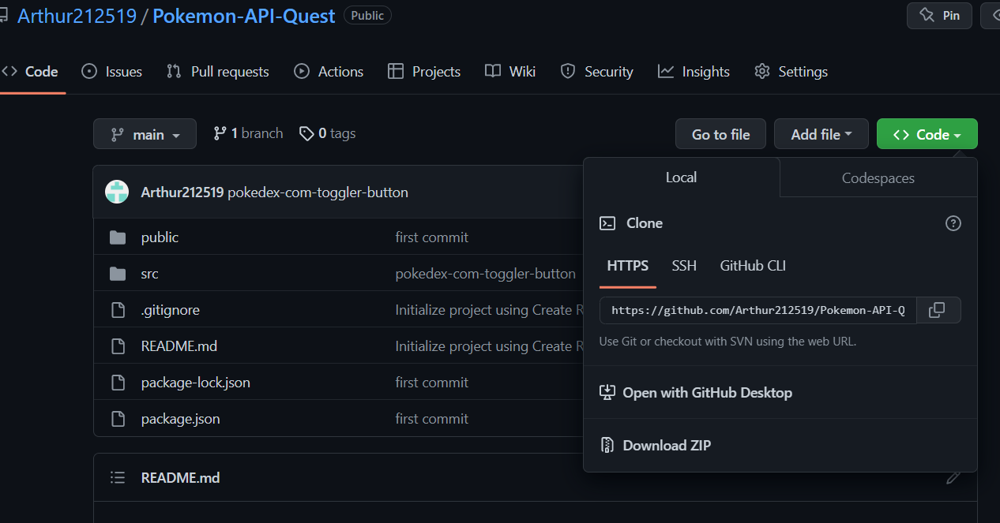
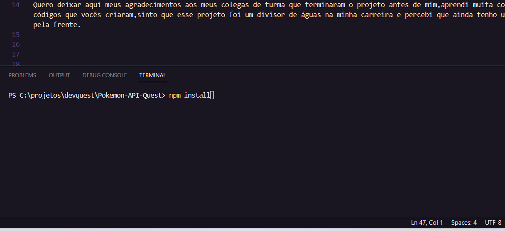

# introdução
Este é o último projeto de devcast,uma pokédex que utiliza dados de uma api para  apresentar uma lista de pokémons com suas habilidades,movimentos e características únicas.
## Tecnologias usadas
* React.js
* Context API
* React Router Dom
* Styled-components
## Desenvolvimento do projeto
Este foi de longe o projeto mais desafiador que eu já fiz,no início, tive muita dificuldade em descobrir por onde começar,então tomei a liberdade de pesquisar outros projetos semelhantes para que  em tivesse uma ideia base.

Quero deixar aqui meus agradecimentos aos meus colegas de turma que terminaram o projeto antes de mim,aprendi muita coisa lendo os códigos que vocês criaram,sinto que esse projeto foi um divisor de águas na minha carreira e percebi que ainda tenho um longo caminho pela frente.

Algumas das requisições feitas eu não pude concluir como por exemplo o seletor que filtrar os pokémons pelo tipo deles.

## Como rodar o projeto no seu computador
### aplicativos necessários
* vs code
* node.js
* gitbash

1- Vá até o repositório onde está o projeto, clique em code e depois copie o link https.

2- Depois crie uma pasta em seu computador,abra ela com o gitbash e digite o código abaixo colocando o link https no final.

    *  git clone https://github.com/Arthur212519/Pokemon-API-Quest.git

3-Depois de clonar o projeto,abra ele com o vs code,digite o comando shift + Ctrl+ ' ou vá na aba terminal para abrir o terminal de comando,Após isso será necessário instalar as bibliotecas utilizadas no projeto usando o seguinte comando.

    *  npm         install

4- Quando terminar de instalar, escreva o comando npm start  no terminal para iniciar o projeto e divirta-se
